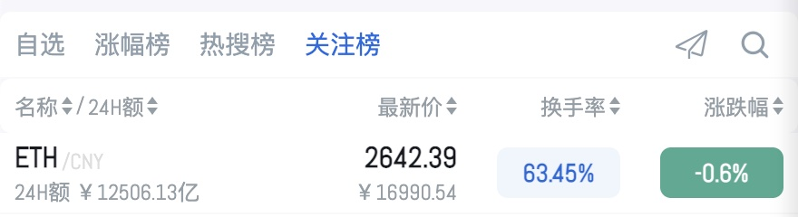
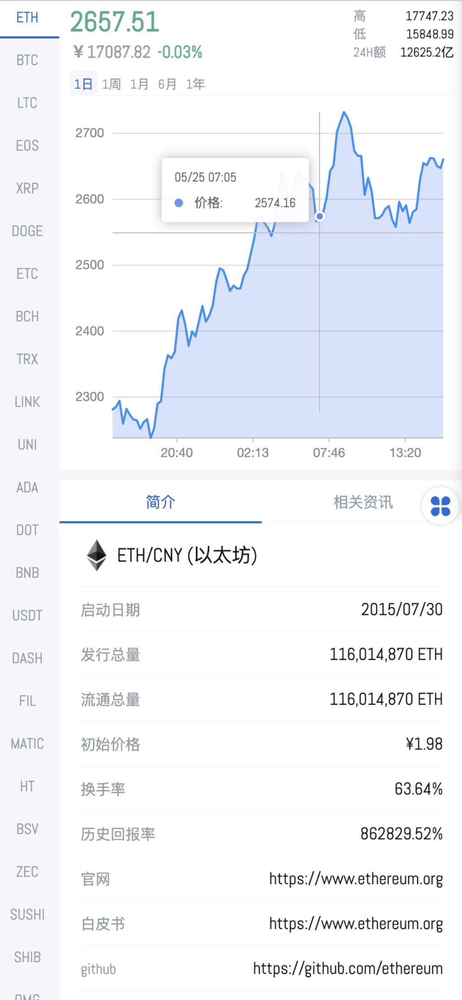
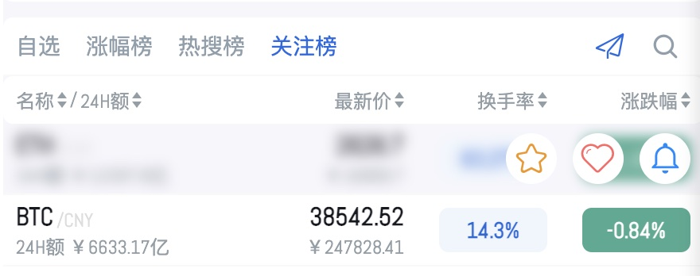
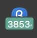
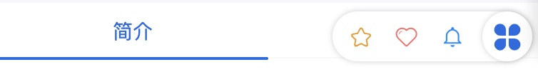
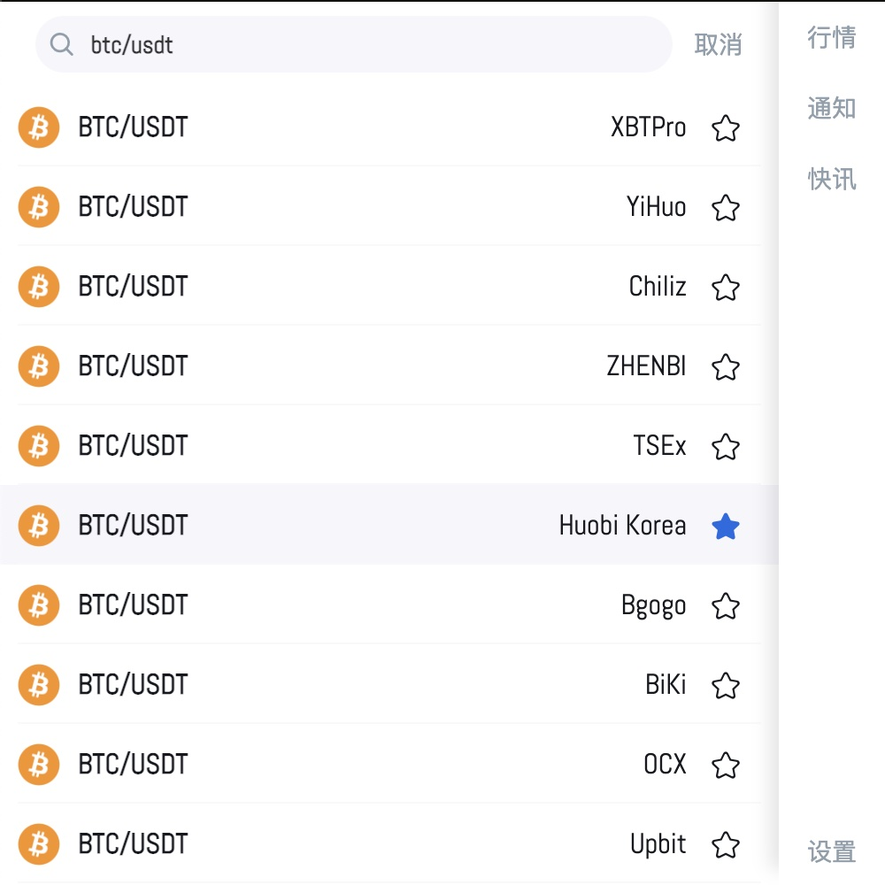
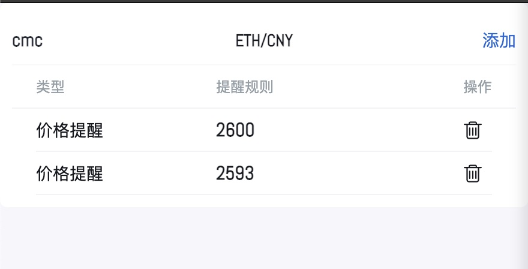
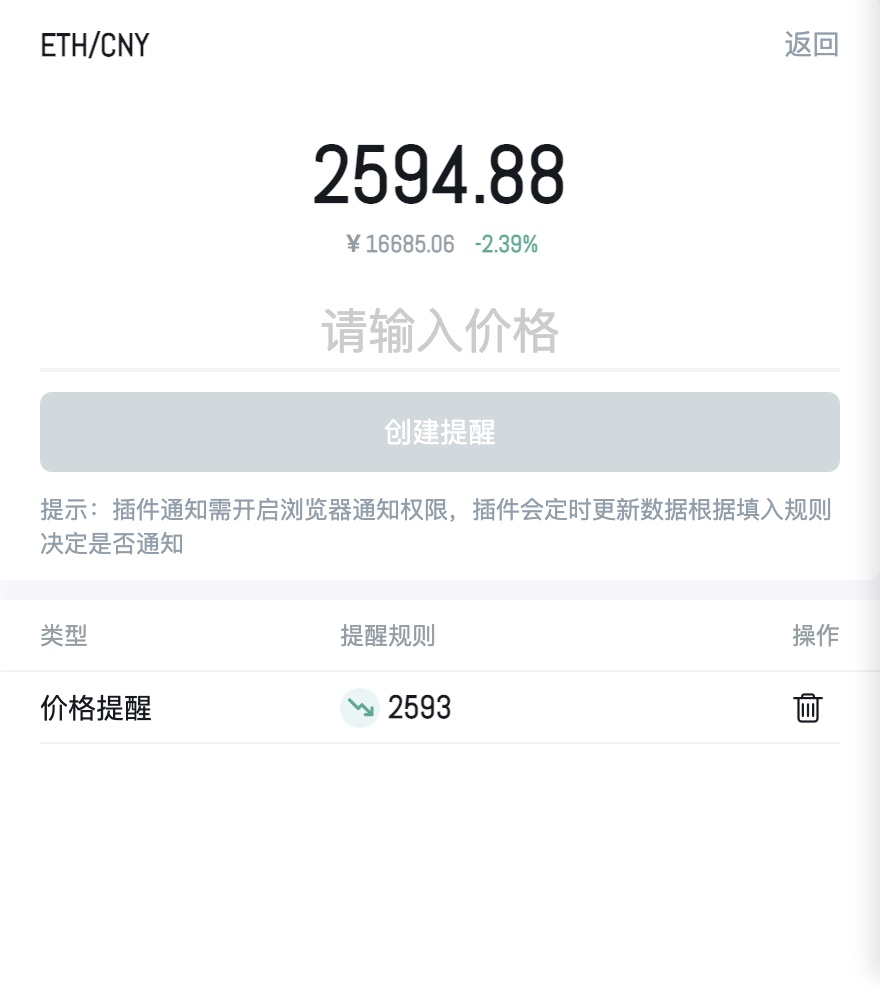
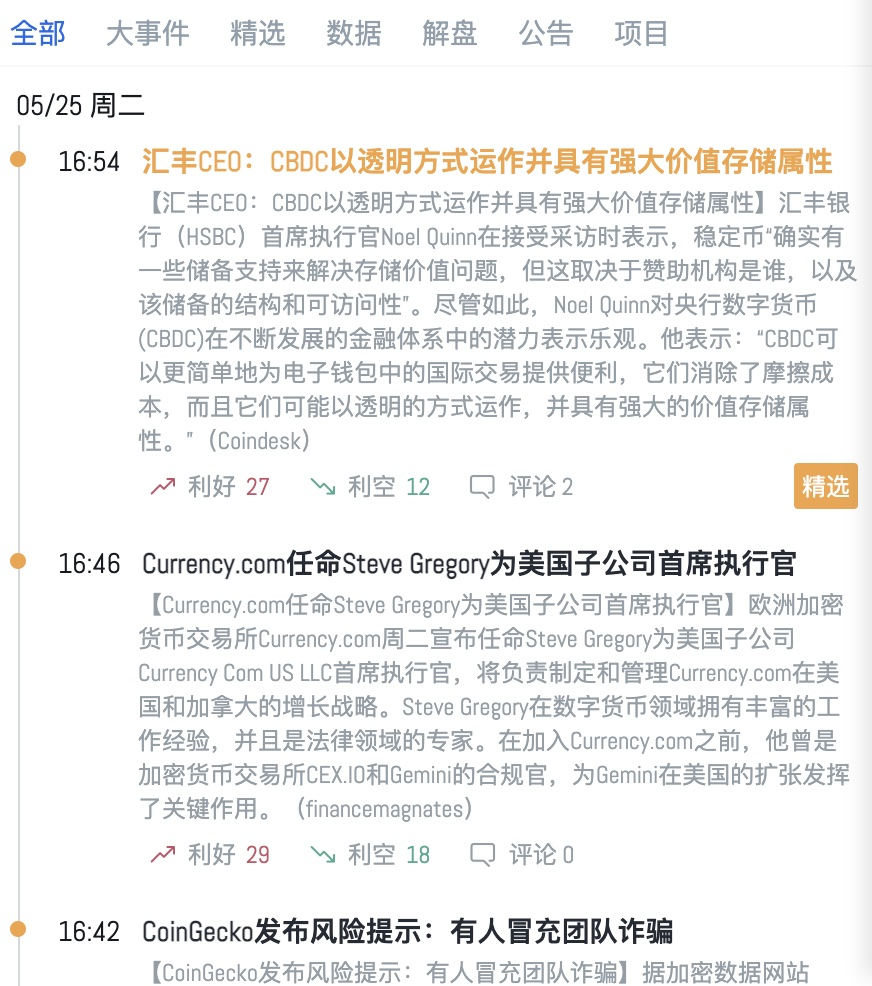

<h1 align="center">
	 
		
	 
	小币
</h1>

”小币“是一款可以快捷查看币圈各平台行情数据，币种价格提醒及币圈新闻资讯的浏览器插件。

## 下载

目前只上架了谷歌市场，无科学上网可下载安装包手动安装，Firefox 及 Edge 浏览器正在适配中。

[谷歌市场](https://chrome.google.com/webstore/detail/acbboldcmppilbflnijahpgobpkkifkh)

[安装包下载](https://chrome.pictureknow.com/extension?id=44ff63184eef4b00bd7db9c7383876e3)

## 行情

插件首页就是币圈的行情数据(数据源来自 [MyToken](https://www.mytokencap.com/) )，目前收录四个类别的行情数据

- 自选
- 涨幅榜
- 热搜榜
- 关注榜

点击币种会打开币种详情；点击小飞机图标，会开启快捷功能入口；点击放大镜会打开搜索页面。

	

### 币种详情

进入详情时，会将当前币种所在列表一起带入左侧侧边栏中，可以快速切换币种。

	

详情页面包括币种走势图，币种简介和币种相关资讯。

由于 MyToken 收录的平台过多，很多走势图的 K 线图数据是没有的，所以会看到有些币种是折线图，有些是 K 线图。

- 简介

  简介里都是当前币种的基础信息：发行流通量、官网、白皮书、twitter、telegram 等等。

  可以从这些信息快速了解该币是否值得投资。

- 资讯

  这里都是当前币种相关的新闻资讯，一些偏门币种可能没有数据。

### 快捷功能

行情页点击小飞机后，鼠标再次 hover 列表时，会看到包含三个功能图标的状态。

	

分别是：自选，特别关注，通知提醒

- 自选：可以添加或取消自选，所有的自选币种可以在”行情 -> 自选“中看到。
- 特别关注：添加特别关注的币种，会在背景页实时更新数据，实时价格变动会在插件图标(badge)下看到。

  有且只有一个特别关注，且默认显示的是 BTC。

  

- 通知提醒：可以直接跳转到此币的通知页面，进行通知设置。

详情页面底部的按钮同样可以唤出这三个功能

	

### 搜索币种

同样是使用 [MyToken](https://www.mytokencap.com/) 的搜索接口，此接口搜索结果是多个平台的某币，并且搜索结果具有随机性(这点我也很头疼)。

	

可以在搜索结果中添加自选。

## 通知

通知首页是管理页，能查看已添加的所有通知。

	

### 通知详情页

针对单个币做通知操作

	

## 快讯

快讯使用 [金色财经](https://www.jinse.com/) 的数据接口，快速了解圈内新闻

	

## 设置

都是些让人舒服的小功能啦，不贴图了，可以自己体验下

- 涨跌反转
- 深浅主题
- 缩小侧边栏
- 自定义窗口大小
- ...

> 提示：未经同意禁止商用，我都没商用

## Contributors

[justwink](https://github.com/justwink) (代码帅，人更帅 - 阿凯老师)

[frankroad](https://chrome.pictureknow.com/) (国内插件镜像平台 - 收藏猫)

## 反馈

有需求或 bug，欢迎积极提 issue~

[现在就提](https://github.com/elegantYU/xiaobi/issues)

## 支持

觉得”小币“还不错的可以 star 一下~(github 和谷歌商店，球球了)

[我要去商店给好评！](https://chrome.google.com/webstore/detail/acbboldcmppilbflnijahpgobpkkifkh)
[直接 Star!](#)
